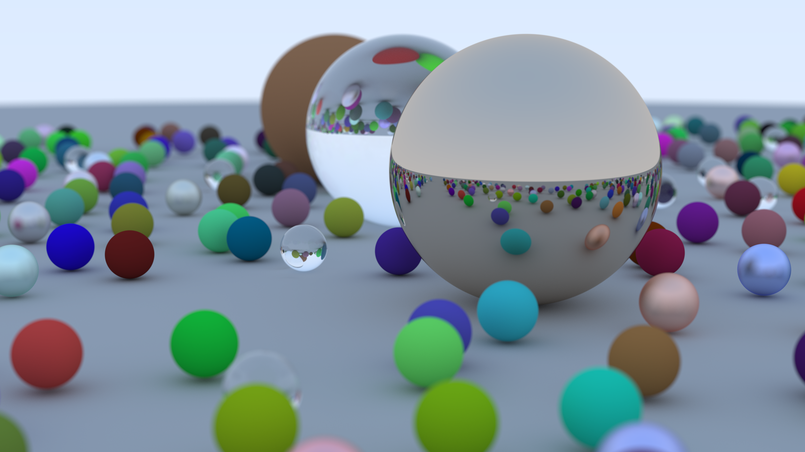

# Ray Tracing in One Weekend



This is my solution to [Ray Tracing in One Weekend](https://raytracing.github.io/books/RayTracingInOneWeekend.html), the first book in the Ray Tracing in One Weekend book series!

The result above was rendered at 5,120 by 2,880 pixels with 512 samples per pixel and up to 64 bounces per ray, which took ~5 hours on a MacBook Pro 16" (M1 Max). With the same configuration, it takes ~20 minutes to render at 1,280 by 720 pixels. The application is a single-threaded process, and maintains 100% CPU utilization while using ~1 MiB memory throughout rendering.

Though I used C++23 and deviate significantly from the book, the solution maintains the same results, and is complete at ~800 source lines of code.

## Implementation Differences

- C++23
  - Rendering uses C++ concepts to intersect with geometry.
  - I use `std::print` and `std::format`, rather than `std::cout` with the stream insertion operator.
- Ray generation logic is part of the `render` function and moved out of the `camera` class.
- Path tracing algorithm is iterative with O(1) memory complexity, rather than recursive with O(n) memory complexity where n is the number of bounces.
- Preferred assertions to defensive programming (I did not implement clamp).
- Preferred radians to degrees (I use `std::numbers::pi` to express radians).

And many more less significant differences...

## Build & Run

**Requirements:**

- cmake
- ninja
- clang

**Build Targets:**

- `debug`
  - used as clangd compilation target
- `release`

### Guide

To build, first generate `./build`:

```sh
cmake --preset debug; cmake --preset release
```

To build and run, use the desired preset and pipe output to a pixmap file:

```sh
cmake --build --preset debug
./build/debug/ray-tracing-in-one-weekend > demo.ppm
```

```sh
cmake --build --preset release
./build/release/ray-tracing-in-one-weekend > demo.ppm
```
